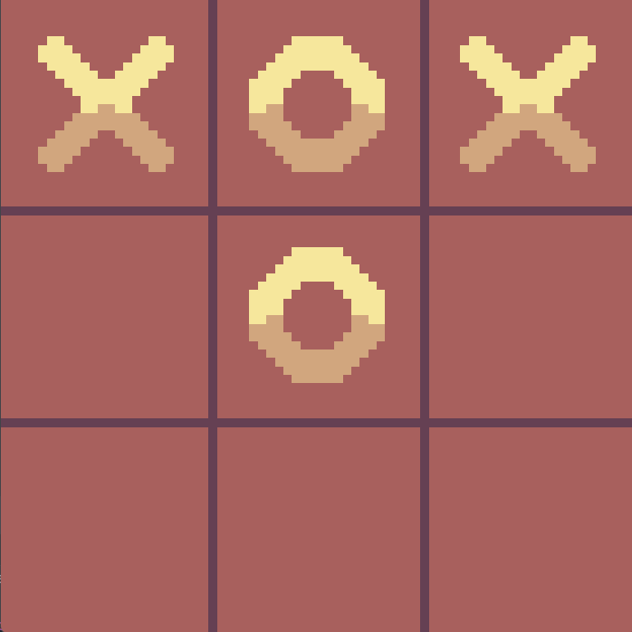
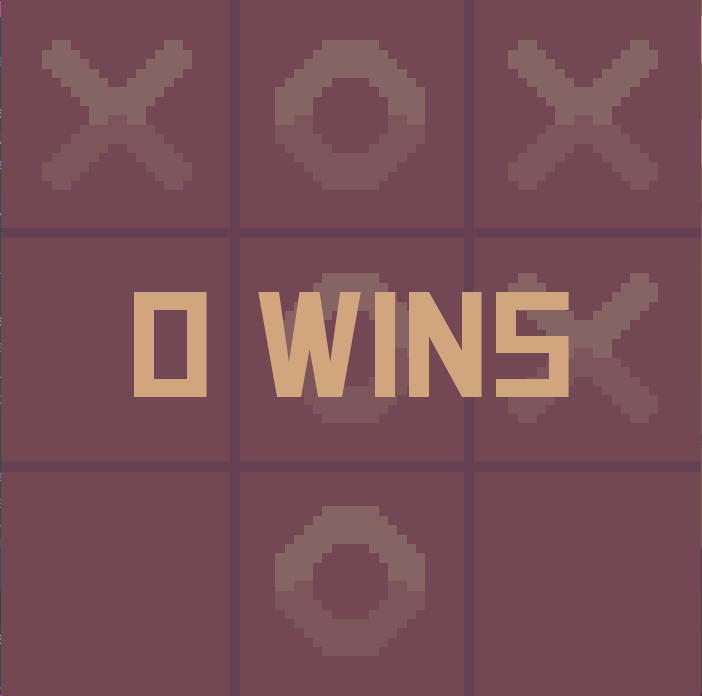

# Tic-Tac-Toe Game with Minmax Algorithm using Pygame

This is a simple Tic-Tac-Toe game implemented using Pygame, where you can play against an AI opponent or another player in PvP mode. The AI uses the Minimax algorithm to make its moves.

<p align="center">
  
  
  

</p>

## Features

- **Single Player (vs AI)**: Play against a computer opponent.
- **Two Player (PvP)**: Play with a friend on the same computer.
- **Minimax AI**: The AI uses the Minimax algorithm to choose the optimal move.
- **Reset Game**: Reset the game at any time by pressing the `r` key.
- **Switch Game Modes**: Toggle between AI and PvP mode by pressing the `g` key.

## Installation

1. **Clone the Repository**
    ```bash
    git clone https://github.com/yourusername/tic-tac-toe-pygame.git
    cd tic-tac-toe-pygame
    ```

2. **Install Pygame**
    ```bash
    pip install pygame
    ```

3. **Run the Game**
    ```bash
    python main.py
    ```

## How to Play

1. **AI Mode**:
    - Play against the computer. The player 'X' starts first.
    - The AI will take over as player 'O'.

2. **PvP Mode**:
    - Play with a friend on the same computer.
    - Player 'X' and Player 'O' take turns marking squares on the grid.

3. **Game Controls**:
    - `r` Key: Reset the game.
    - `g` Key: Switch between AI and PvP modes.

## Game Logic

- **Board Class**: Manages the state of the Tic-Tac-Toe grid and checks for winning conditions.
- **AI Class**: Uses the Minimax algorithm to decide the best move for the computer.
- **Game Class**: Manages the game flow, handles player inputs, and draws the game board and pieces on the screen.

## Dependencies

- Python 3.8
- Pygame

## Assets

The game uses assets for the 'X' and 'O' symbols by [M1K3_dev](https://m1k3-dev.itch.io/tic-tac-toe-asset-pack "M1K3_dev"). These assets are located in the `assets` directory.

